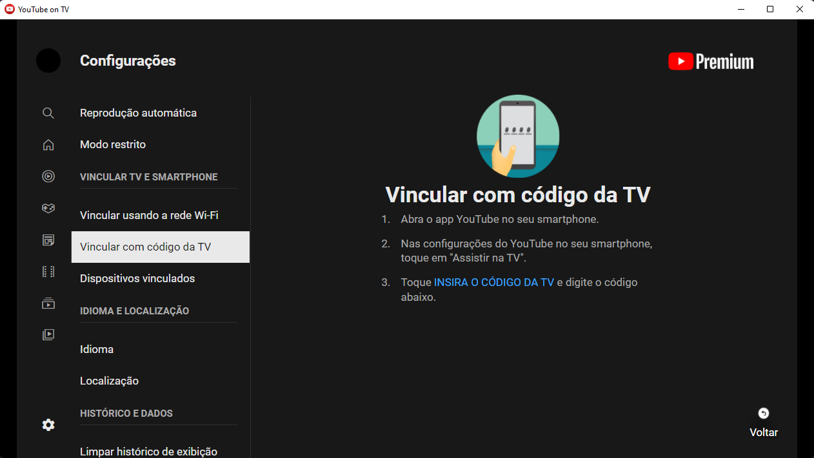
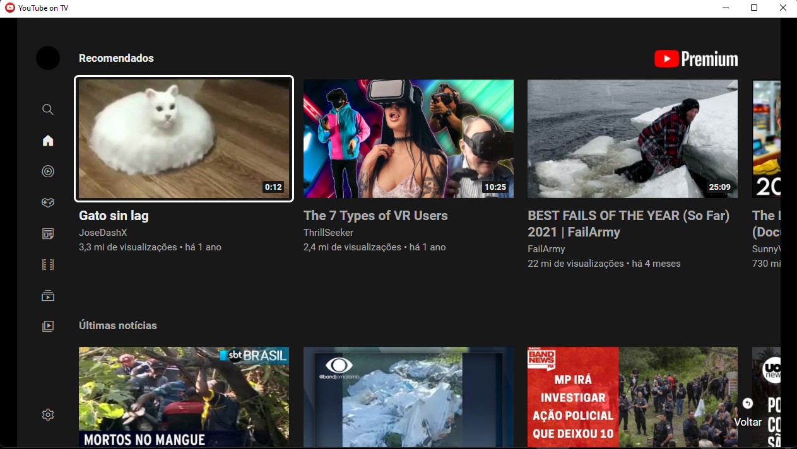

# Electron Youtube TV

This app was made originaly by user @amoshydra.

The implementation here differs from his on the following matters:
- Now for the app to work is necessary to use a user-agent from a tv or similar device, the one I am using I got from the Samsung website.
- It's possible to use a code to cast the content from your mobile app.
- I remove the tray options, but if tuns out to be possible to make the content full screen when casting, it would be a very nice usage.
- The app starts in full-screen now, but it can be toogled using "alt+enter"

## Link devices


## Using account  


## Running the app
```
npm start
```

## Distributing
```
npm run dist
```
